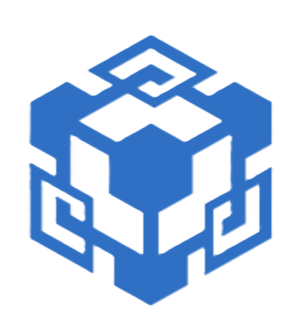

  

<h1 align="center">ALETHEA</h1>

AI-powered log intelligence, PR risk analysis, incident memory, and conversational debugging for engineering teams.

---

## 🔷 Overview

**Alethea** is an AI-driven engineering intelligence platform that sits alongside your development workflow and continuously learns from:

- System logs  
- Past incidents  
- Pull requests  
- Conversations and queries  
- User-submitted troubleshooting history  
- Caching for fast and quick retrieval of data

It turns chaotic operational data into **clarity, explanations, and warnings before failures happen**.

Alethea serves as your team’s **central knowledge layer**, helping engineers debug faster, review safer, and ship with confidence.

All installation instructions and setup steps are available in **`installation.md`** in the docs folder.

---

## 🌐 Live Website

Alethea is live and accessible here: **[https://alethea-dev.vercel.app](https://alethea-dev.vercel.app)**  
Backend Server is hosted at Google CLoud Run using dockerhub image

---

## 🚀 Key Features

### 1. **AI Log Intelligence**
- Convert raw logs into readable explanations.
- Automatically detect:
  - Error bursts / spikes  
  - Retry loops  
  - Timeouts  
  - Hidden anomalies and unusual sequences  
- Provides summaries, root-cause hints, and recommended fixes.

---

### 2. **PR Risk Analyzer**
Alethea reads every pull request and analyzes it for:

- Potential breaking changes  
- Risky patterns  
- Security-sensitive code  
- Logic-level regressions  
- Inconsistent error handling  
- Anti-patterns in refactors  

Then the analysis is automatically commented on your PR for accessibility.

---

### 3. **Memory-Backed Chat Assistant**
Talk to Alethea like a teammate.

It can answer questions about:

- Previous incidents  
- Past logs  
- PR history  
- Trends across time  
- Rare errors that have happened previously 

Alethea uses embedding-based long-term memory to recall past events and provide deeper insights.

---

### 4. **Incident Insights & Correlation**
Alethea automatically tracks patterns like:

- “This timeout resembles the one from Sept 14.”  
- “This PR introduces a pattern similar to the PR that broke auth last month.”  
- “Errors started after the recent deployment to API v2.”  

It connects logs → PRs → incidents into a readable timeline.

---

### 5. **Global Intelligence Engine**
Alethea's architecture allows it to:

- Build long-term memory  
- Improve anomaly detection over time  
- Become more intelligent while isolating user data securely  

- NOTE: Currently this is disabled and a direct workaround is implemented to prevent AI model costs in beta phase.

---

### 6. **Clean Modern UI (Next.js + Tailwind)**
Alethea includes:

- Dashboard  
- Logs analysis view  
- PR analyzer  
- Chatbot
- OAuth login (Google / GitHub)  
- Authentication-aware layout  

All pages are responsive and optimized.

---

### Architecture and Repository Structure 

Access it from **`architecture.md`** in the docs folder.

---

## ❤️ Note from the Developer

Alethea is still under active development, so please ignore any small bugs or rough edges you may encounter.  
It is built with a lot of effort, passion, and love.

Your feedback is always appreciated and actively encouraged.

If you'd like to share suggestions, report issues, or contribute:

- Create an Issue in the repository  
- Or reach out directly at **shreyanshpaliwalcmsmn@gmail.com**

Thank you for supporting Alethea’s journey 🫶
